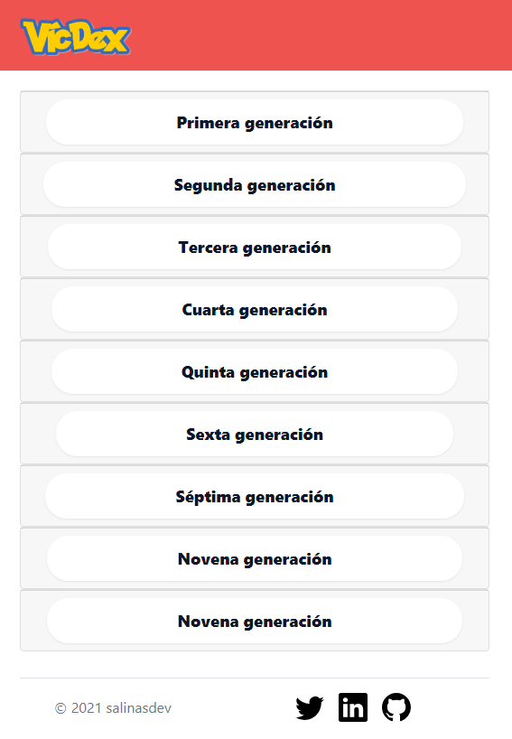
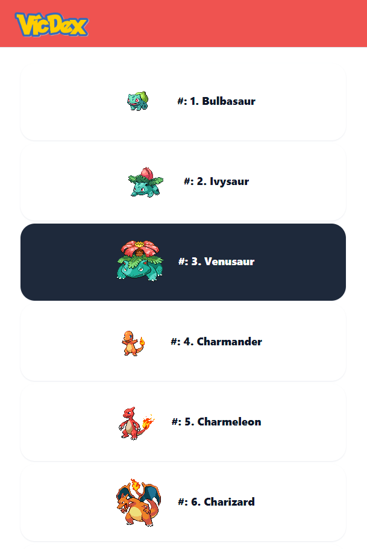

<div align="center">
  
  
  # 🔴 Pokédex LitElement
  
  ### Una Pokédex completa y moderna construida con Web Components
  
  [](https://lit.dev)
  [](https://pokeapi.co)
  [](https://github.com/open-wc)
  [](LICENSE)
  
  [🌐 Demo en Vivo](https://podekex-lit.onrender.com/) | [📖 Documentación](#características) | [🚀 Inicio Rápido](#instalación)
  
</div>

---

## 📋 Tabla de Contenidos

- [Características](#-características-principales)
- [Capturas de Pantalla](#-capturas-de-pantalla)
- [Tecnologías](#️-tecnologías-utilizadas)
- [Instalación](#-instalación)
- [Scripts Disponibles](#-scripts-disponibles)
- [Estructura del Proyecto](#-estructura-del-proyecto)
- [Contribuir](#-contribuir)

---

## ✨ Características Principales

### 🎮 Simulador de Batallas Pokémon
Simulador de combate completo con mecánicas competitivas:
- ⚔️ **Sistema de Combate por Turnos**: Batallas 1v1 con selección de nivel
- 💥 **Cálculo de Daño Realista**: Implementa la fórmula oficial de Pokémon
- 🎯 **Efectividad de Tipos**: Sistema completo de ventajas/desventajas
- 🩹 **Daño de Retroceso**: Movimientos como Voltio Cruel, Doble Filo, Ariete
- 🔥 **Condiciones de Estado**: Parálisis, Quemadura, Sueño, Veneno
- 📈 **Cambios de Estadísticas**: +6/-6 etapas (Ataque, Defensa, Velocidad, etc.)
- 🎲 **Golpes Críticos**: Sistema de críticos con probabilidad realista
- 📊 **Registro de Batalla**: Historial detallado de todos los movimientos
- 🔄 **Reset Automático**: Sistema de reinicio para nuevas batallas

**Movimientos Especiales Implementados:**
- Status: Thunder Wave, Will-O-Wisp, Spore, Toxic, Sleep Powder
- Stat Boost: Swords Dance, Dragon Dance, Nasty Plot, Calm Mind, Agility
- Stat Drop: Growl, Leer, Scary Face, Screech, Sand Attack
- Recoil: Wild Charge, Brave Bird, Head Smash, Flare Blitz
- Swap: Power Swap, Guard Swap

### 👥 Constructor de Equipos
Herramienta avanzada para crear equipos competitivos:
- **Hasta 6 Pokémon** en tu equipo
- **Análisis de Debilidades**: Identifica amenazas con multiplicadores de daño
- **Cobertura de Tipos**: Visualiza todos los tipos en tu equipo
- **Inmunidades Totales**: Detecta tipos contra los que eres inmune
- **Exportación de Equipos**: Copia tu equipo al portapapeles
- **Persistencia Local**: Tu equipo se guarda automáticamente

### 📊 Estadísticas y Análisis
- **Rankings por Tipo**: Top Pokémon más fuertes de cada tipo
- **Comparador de Stats**: Compara hasta 2 Pokémon lado a lado
- **Gráficos Radar**: Visualización interactiva de estadísticas base
- **Filtros Avanzados**: Por tipo, generación, y stats mínimos

### 🎯 Desafío Diario
- Adivina el Pokémon misterioso del día
- **Sistema de Pistas Progresivas**
- **Puntuación y Estadísticas**
- **Nuevo desafío cada 24 horas**

### 🎉 Eventos y Noticias Pokémon
- **Feed en Tiempo Real** desde Pokémon Blog
- Filtrado por categorías (Pokémon GO, TCG, Anime, Videojuegos)
- Imágenes de alta calidad
- Actualizaciones automáticas

### 🗺️ Localizaciones y Encuentros
- **Mapa Interactivo** de ubicaciones por juego
- Detalles de encuentros (método, nivel, probabilidad)
- Imágenes de las áreas del juego
- Filtrado por versión

### 🔍 Búsqueda Avanzada
- **Búsqueda Inteligente** por nombre o número
- Filtros múltiples (tipo, generación, stats)
- Ordenamiento personalizable
- Resultados instantáneos

### 🎨 Interfaz y Diseño
- 🌓 **Modo Oscuro/Claro** con transiciones suaves
- 📱 **Diseño Responsive** para móviles y tablets
- 🎭 **Animaciones Fluidas** con CSS/JavaScript
- 🖼️ **Galería de Sprites** (normal, shiny, forms)
- 🎨 **Colores por Tipo** en toda la interfaz

### 📖 Información Detallada
- **Fichas Completas** de cada Pokémon
- Estadísticas base y calculadas
- Cadena evolutiva interactiva
- Movimientos aprendibles (por nivel, MT, tutor)
- Habilidades y características
- Descripción de Pokédex multilingüe

---

## 📸 Capturas de Pantalla

<div align="center">

### 🏠 Página Principal - Modo Claro


### � Página Principal - Modo Oscuro


</div>

### 🎮 Más Capturas (Próximamente)

> **📝 Nota:** Para añadir más capturas de pantalla del simulador de batallas y otras características:
> 
> 1. Toma capturas de pantalla con `Win + Shift + S`
> 2. Guárdalas en la carpeta `screenshots/` o `images/`
> 3. Actualiza las rutas en este README
> 
> **Capturas sugeridas:**
> - `battle-simulator.png` - Simulador de batallas con efectos de estado
> - `team-builder.png` - Constructor de equipos con análisis de debilidades
> - `pokemon-detail.png` - Ficha detallada de un Pokémon
> - `mobile-view.png` - Vista responsive en dispositivos móviles

---

## 🛠️ Tecnologías Utilizadas

<div align="center">

| Tecnología | Descripción |
|------------|-------------|
|  | Web Components reactivos y ligeros |
|  | ES6+ con módulos nativos |
|  | CSS moderno con variables y grid |
|  | API REST completa de Pokémon |
|  | Herramientas de desarrollo |
|  | Estándar nativo del navegador |

</div>

### Características Técnicas

- ⚡ **Sin Frameworks Pesados**: Solo Web Components nativos con LitElement
- 🚀 **Rendimiento Optimizado**: Lazy loading y caching inteligente
- 🔒 **Type Safety**: JSDoc para documentación y autocompletado
- 📦 **Modular**: Componentes reutilizables e independientes
- 🎯 **SEO Friendly**: Server-side rendering compatible
- ♿ **Accesible**: Cumple con estándares WCAG

---

## 🚀 Instalación

### Requisitos Previos

- Node.js >= 14.x
- npm >= 6.x

### Pasos de Instalación

```bash
# 1. Clonar el repositorio
git clone https://github.com/salinasdev/pokedex-lit.git
cd pokedex-lit

# 2. Instalar dependencias
npm install

# 3. Iniciar servidor de desarrollo
npm start
```

La aplicación estará disponible en `http://localhost:8000`

---

## 📜 Scripts Disponibles

| Comando | Descripción |
|---------|-------------|
| `npm start` | 🔥 Inicia servidor de desarrollo con hot-reload |
| `npm run build` | 📦 Compila la aplicación para producción |
| `npm run start:build` | 🚀 Ejecuta la versión compilada |
| `npm test` | 🧪 Ejecuta los tests con Web Test Runner |
| `npm run lint` | 🔍 Analiza el código con ESLint |
| `npm run format` | ✨ Formatea el código con Prettier |

---

## 📁 Estructura del Proyecto

```
pokedex-lit/
├── 📂 src/                          # Código fuente
│   ├── 📂 pokedex-app/              # Componente principal
│   ├── 📂 pokedex-header/           # Cabecera con navegación
│   ├── 📂 pokedex-footer/           # Pie de página
│   ├── 📂 pokedex-main/             # Vista principal (listado)
│   ├── 📂 pokedex-generation-card/  # Tarjetas de generaciones
│   ├── 📂 pokemon-data/             # Ficha detallada de Pokémon
│   ├── 📂 pokemon-ficha-listado/    # Tarjeta en listado
│   ├── 📂 pokemon-ficha-detalle/    # Vista detallada
│   ├── 📂 pokemon-sidebar/          # Panel lateral de eventos
│   └── 📂 pokemon-battle-simulator/ # ⚔️ Simulador de batallas
│
├── 📂 css/                          # Estilos globales
│   └── estilo.css
│
├── 📂 img/                          # Imágenes y recursos
│   ├── logo.png
│   ├── generation-*.png
│   ├── 📂 types/                    # Iconos de tipos
│   ├── 📂 areas/                    # Imágenes de localizaciones
│   └── 📂 versions/                 # Iconos de versiones
│
├── 📂 screenshots/                  # Capturas para README
│
├── 📄 index.html                    # Punto de entrada
├── 📄 package.json                  # Dependencias
├── 📄 web-dev-server.config.mjs     # Configuración del servidor
└── 📄 README.md                     # Este archivo
```

---

## 🎓 Componentes Principales

### `<pokedex-app>`
Componente raíz que gestiona el enrutamiento y estado global.

### `<pokemon-battle-simulator>`
Simulador completo de batallas con:
- Sistema de turnos
- Cálculo de daño con fórmula oficial
- Efectos de estado (burn, paralysis, sleep, poison)
- Cambios de estadísticas (-6 a +6 etapas)
- Movimientos de retroceso
- Registro de batalla

### `<pokemon-data>`
Ficha detallada con tabs:
- About (descripción, características)
- Stats (estadísticas con gráficos)
- Evolution (cadena evolutiva)
- Moves (movimientos aprendibles)
- Locations (encuentros en juegos)

---

## 🤝 Contribuir

¡Las contribuciones son bienvenidas! Si quieres mejorar este proyecto:

1. 🍴 Fork el repositorio
2. 🌿 Crea una rama para tu feature (`git checkout -b feature/AmazingFeature`)
3. 💾 Commit tus cambios (`git commit -m 'Add some AmazingFeature'`)
4. 📤 Push a la rama (`git push origin feature/AmazingFeature`)
5. 🔀 Abre un Pull Request

---

## 📝 Licencia

Este proyecto está bajo la Licencia MIT. Ver el archivo [LICENSE](LICENSE) para más detalles.

---

## 🙏 Agradecimientos

- [PokéAPI](https://pokeapi.co/) - Por proporcionar la API completa de Pokémon
- [LitElement](https://lit.dev/) - Por hacer los Web Components tan simples
- [Open-WC](https://open-wc.org/) - Por las herramientas de desarrollo
- The Pokémon Company - Por crear este universo increíble

---

## 📞 Contacto

¿Preguntas o sugerencias? ¡No dudes en contactar!

- 🌐 Demo: [https://podekex-lit.onrender.com/](https://podekex-lit.onrender.com/)
- 💼 GitHub: [@salinasdev](https://github.com/salinasdev)

---

<div align="center">
  
  **⭐ Si te gusta este proyecto, no olvides darle una estrella ⭐**
  
  Hecho con ❤️ y ☕ por [salinasdev](https://github.com/salinasdev)
  
</div>
